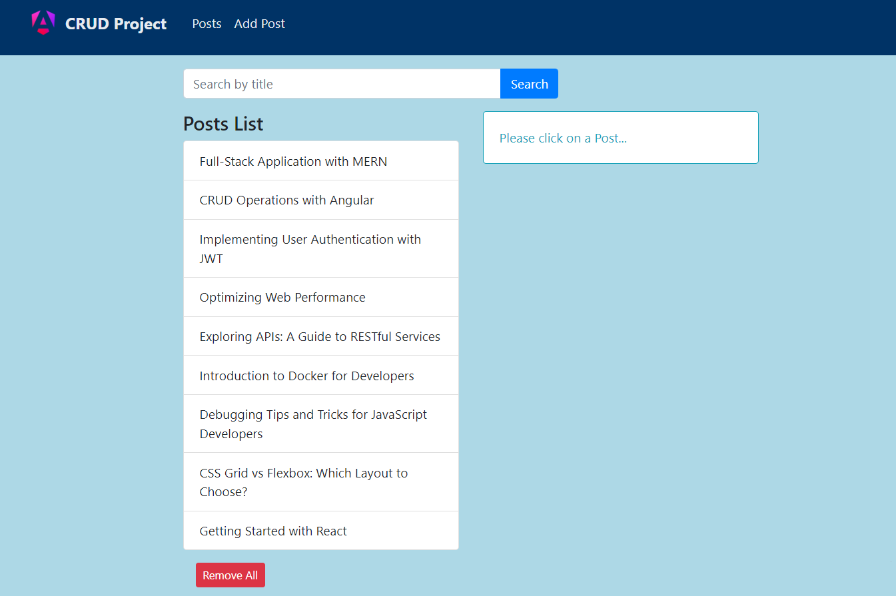
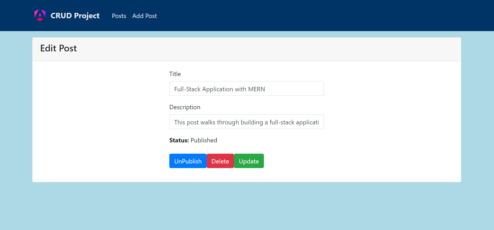

# CRUD Application with Angular, Spring Boot, and MySQL

This is a CRUD (Create, Read, Update, Delete) web application built using Angular for the frontend, Spring Boot for the backend, and MySQL for database management. This application demonstrates how to perform basic CRUD operations, manage data, and connect the frontend with backend services.

## Table of Contents

- [Demo](#demo)
- [Features](#features)
- [Technologies Used](#technologies-used)
- [Project Setup](#project-setup)
  - [Backend Setup (Spring Boot)](#backend-setup-spring-boot)
  - [Frontend Setup (Angular)](#frontend-setup-angular)
  - [Database Setup (MySQL)](#database-setup-mysql)
- [Endpoints](#endpoints)
- [Running Tests](#running-tests)
- [Deployment](#deployment)
- [Screenshots](#screenshots)
- [Contributing](#contributing)
- [License](#license)

## Demo

> [CRUD Project Website](https://spring-boot-app-kzgt.onrender.com)

## Features

- **Create**: Users can add new posts.
- **Read**: Users can view the list of all posts.
- **Update**: Users can edit existing posts.
- **Delete**: Users can delete single or all posts.
- **Search**: Users can search posts by title.
- **Publish/Unpublish**: Ability to publish or unpublish posts.

## Technologies Used

### Frontend (Angular)

- **Angular 17**: Modern web development framework for building single-page applications.
- **Bootstrap**: Responsive layout and UI components for design.
- **RxJS**: Reactive programming for asynchronous data handling.

### Backend (Spring Boot)

- **Spring Boot 3.1.5**: Backend framework for creating RESTful APIs.
- **Spring Data JPA**: Simplifies database interaction with MySQL.
- **Hibernate ORM**: Framework for mapping Java objects to database tables.
- **MySQL**: Relational database for data persistence.

### Database

- **MySQL 8.0**: Stores the data for the application, which includes posts data.

## Project Setup

### Prerequisites

Before you begin, ensure you have installed the following:

- **Node.js** (v16 or later)
- **Angular CLI** (v12 or later)
- **MySQL** (v8.0 or later)
- **Maven** (v3.6 or later)

### Backend Setup (Spring Boot)

1. Clone the repository:
   ```bash
   git clone [https://github.com/oyewoleoluwaseun/CRUD-angular-17-with-spring-boot-and-mysql]
   ```

2. Navigate to the backend directory:
   ```bash
   cd backend
   ```

3. Configure MySQL by updating the `application.properties` file located in `src/main/resources/` with your MySQL database credentials:
   ```properties
   spring.datasource.url=jdbc:mysql://localhost:3306/testdb
   spring.datasource.username=your_username
   spring.datasource.password=your_password
   spring.jpa.hibernate.ddl-auto=update
   spring.jpa.show-sql=true
   ```

4. Build and run the backend service using Maven:
   ```bash
   mvn clean install
   mvn spring-boot:run
   ```
   The backend service will start at [http://localhost:8080](http://localhost:8080).

### Frontend Setup (Angular)

1. Navigate to the frontend directory:
   ```bash
   cd angular-frontend
   ```

2. Install the required Node modules:
   ```bash
   npm install
   ```

3. Run the Angular development server:
   ```bash
   ng serve --port 8081
   ```
   The application will be accessible at [http://localhost:8081](http://localhost:8081).

### Database Setup (MySQL)

1. Create a MySQL database by running the following command in your MySQL CLI or MySQL Workbench:
   ```sql
   CREATE DATABASE testdb;
   ```

2. Ensure that the MySQL server is running on localhost with the appropriate username and password.

## Endpoints

REST API Endpoints for CRUD Operations:

- `GET /api/tutorials`: Retrieve all posts.
- `GET /api/tutorials/{id}`: Retrieve a post by ID.
- `POST /api/tutorials`: Create a new post.
- `PUT /api/tutorials/{id}`: Update an existing post by ID.
- `DELETE /api/tutorials/{id}`: Delete a post by ID.
- `DELETE /api/tutorials`: Delete all posts.
- `GET /api/tutorials/published`: Retrieve all published posts.
- `GET /api/tutorials?title={title}`: Search posts by title.

## Running Tests

### Backend Tests

The backend includes unit tests using JUnit. To run the tests, execute:

```bash
mvn test
```

### Frontend Tests

To run the Angular unit tests (using Jasmine and Karma), execute:

```bash
ng test
```

## Deployment

### Deploying the Backend (Spring Boot)

You can deploy the Spring Boot backend using:

- **Docker**: Create a Dockerfile, build the image, and deploy it to a cloud provider such as Render or Heroku.
- **Clever Cloud** or other cloud platforms that support Java.

### Deploying the Frontend (Angular)

You can host Angular on platforms like Vercel, Netlify, or your custom server. To deploy:

1. Build the Angular project for production:
   ```bash
   ng build --prod
   ```

2. Upload the generated `dist/` folder to your hosting platform.

## Screenshots




## Contributing

If you'd like to contribute, please fork the repository and use a feature branch. Pull requests are warmly welcome.

1. Fork the repository.
2. Create your feature branch:
   ```bash
   git checkout -b feature-name
   ```
3. Commit your changes:
   ```bash
   git commit -m 'Add some feature'
   ```
4. Push to the branch:
   ```bash
   git push origin feature-name
   ```
5. Submit a pull request.

## License

This project is licensed under the MIT License - see the LICENSE file for details.
